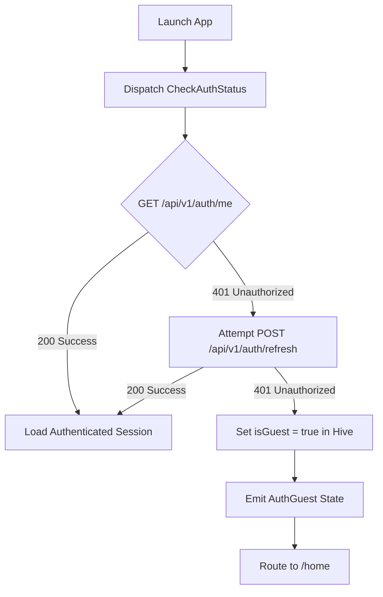
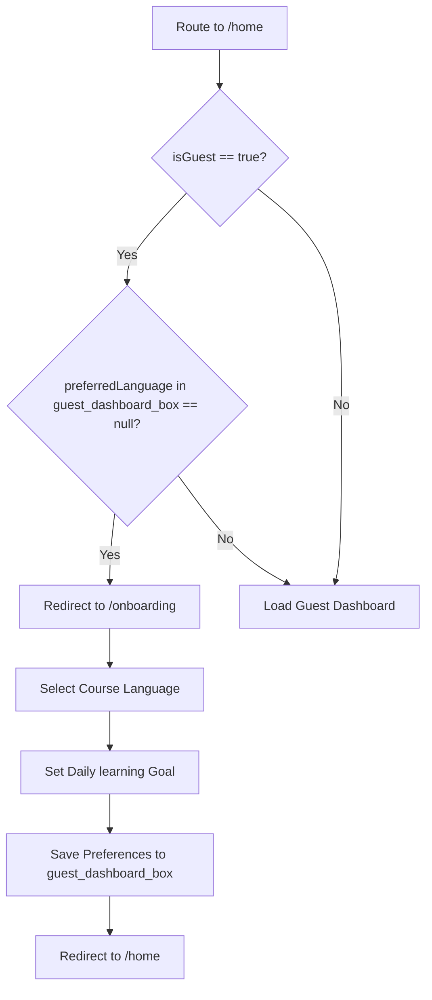
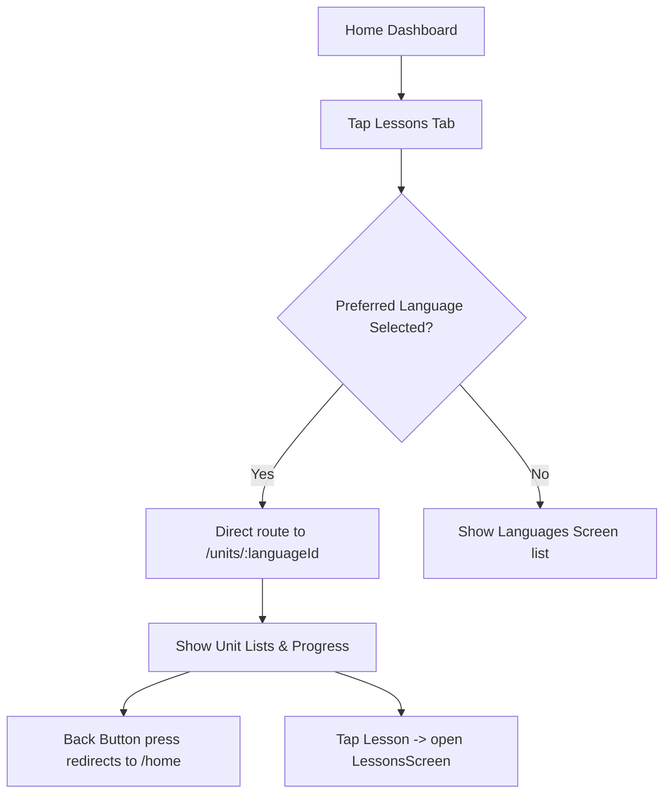
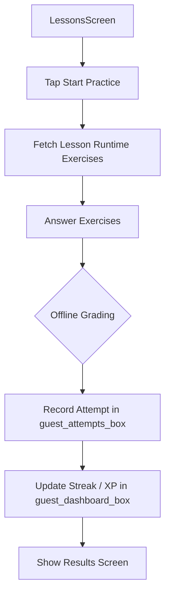
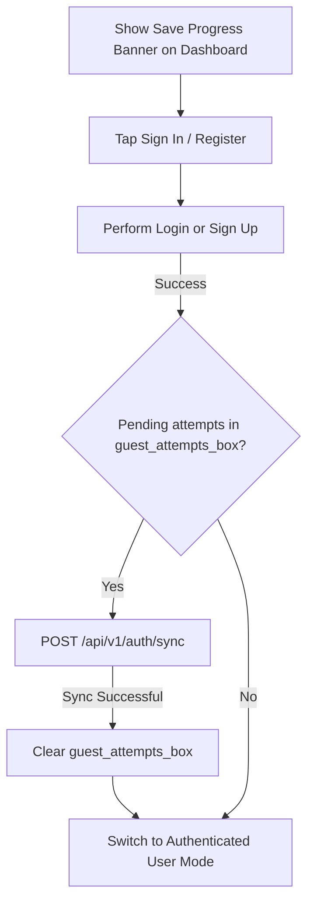

# Guest Mode & Unauthenticated User Flow Spec

This document details the complete end-to-end user flow for unauthenticated/guest users in the Lingo-Abyssinia Flutter mobile application.

---

## 1. App Launch & Authentication Check

On startup, the application verifies the active session state:

1. **Check Session (`/auth/me`):** Hits backend unauthenticated. If cookies are present and valid, logs the user in.
2. **Refresh Session (`/auth/refresh`):** If expired or 401 is received, attempts to refresh using cookies.
3. **Guest Fallback:** If both fail, writes `isGuest = true` to `auth_preferences_box` (Hive) and transitions the `AuthBloc` to `AuthGuest`.
4. **Initial Navigation:** App Router defaults to `/home` (Learner HomeScreen).

---

## 2. Onboarding & Language Selection

A guest user must select a language and goal to start learning.

* **First-Time Guest:**
  - If the `guest_dashboard_box` has no `preferredLanguage` set, the user is redirected automatically to `/onboarding`.
  - In `/onboarding`, the user selects their target language course (Amharic, Afan Oromoo, Tigrinya) and a daily study goal (5, 15, or 30 minutes).
  - Tapping **Start Learning** saves the preferences in `guest_dashboard_box` and redirects them back to `/home`.
* **Returning Guest:**
  - If a language preference already exists, the onboarding screen is bypassed, and the home dashboard loads directly.

---

## 3. Main Navigation & Lessons Tab

Guests can browse courses, units, and lessons without an account.

* **Lessons Bottom Tab:** Tapping the **Lessons** tab checks the preferred language:
  - If set, routes directly to `/units/:languageId` (bypassing the list selection).
  - Tapping **Back** in `UnitsScreen` returns them directly to `/home` to avoid infinite redirection loops.
* **Curriculum Exploration:** Inside `/units/:languageId`, the user can view units, select lessons, and study the interactive study material.

---

## 4. Practice & Offline Grading Flow

The core practice sessions are entirely supported offline using client-side grading.

1. **Lesson Runtime:** The app fetches the lesson's runtime exercises (including correct options or accepted answers).
2. **Interactive Session:** The guest goes through multiple-choice, listening, and text translation exercises.
3. **Client-Side Grading:** 
   - Multiple choice/listening: Matches option IDs against `correctOptionIds`.
   - Text translations: Trims, lowercases, collapses whitespace, and compares input against `acceptedAnswers`.
4. **Stats Recording:**
   - The completed attempt is stored in Hive (`guest_attempts_box`).
   - The streak count and XP points are updated locally in `guest_dashboard_box`.

---

## 5. Account Creation & Progress Syncing

Guests can upgrade to a full account at any time to persist their progress to the cloud database.

* **Save Progress Banner:** Guests are constantly shown a clean, secondary-colored CTA banner at the top of the dashboard.
* **On Authentication (Login/Register):**
  - Once the user successfully signs in or registers a new account, the app checks if `guest_attempts_box` contains any offline attempts.
  - If so, it sends the payload to `POST /api/v1/auth/sync` (or the equivalent synchronization endpoint).
  - Upon success, it clears the local attempts box and loads the newly synchronized profile.

---
